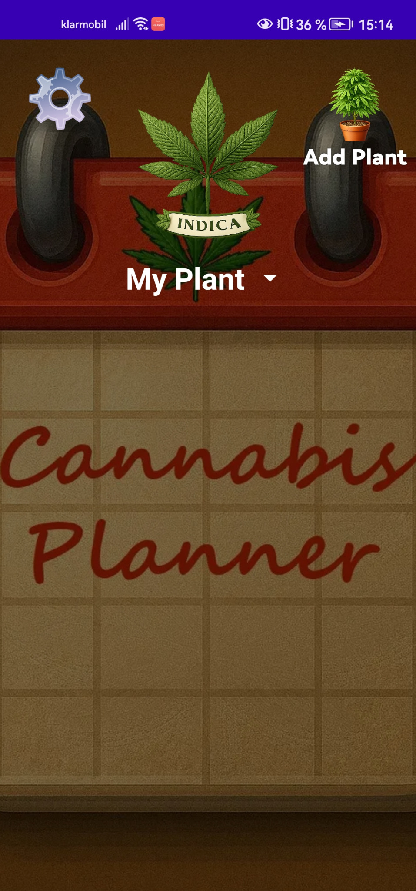
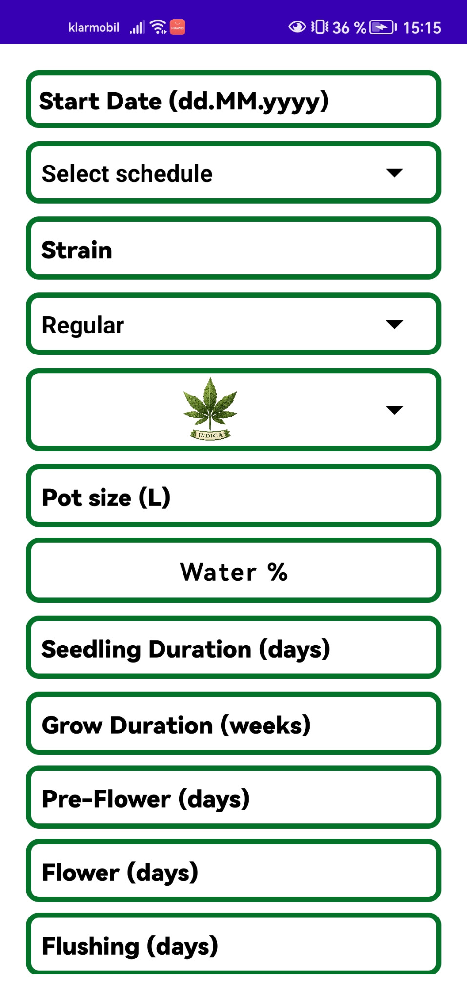
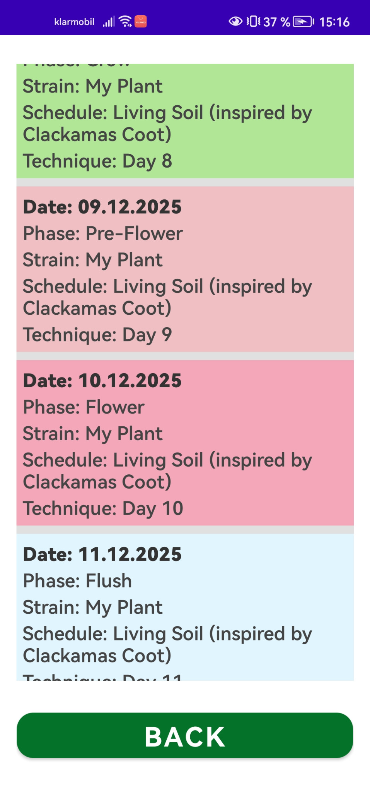
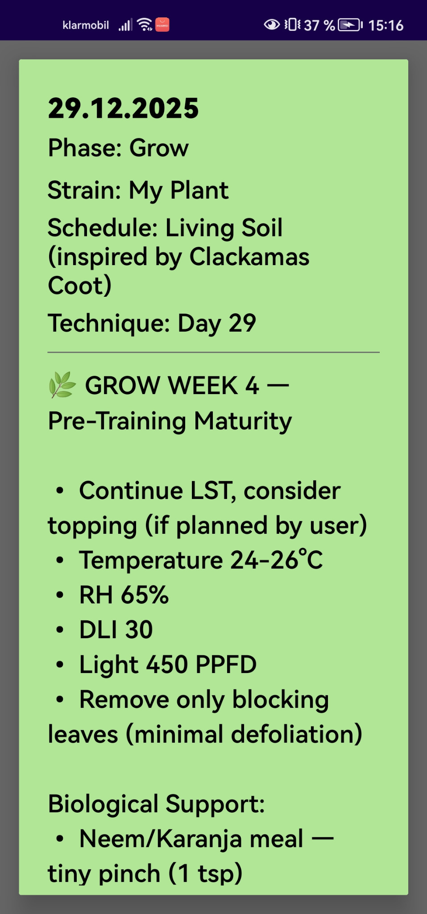
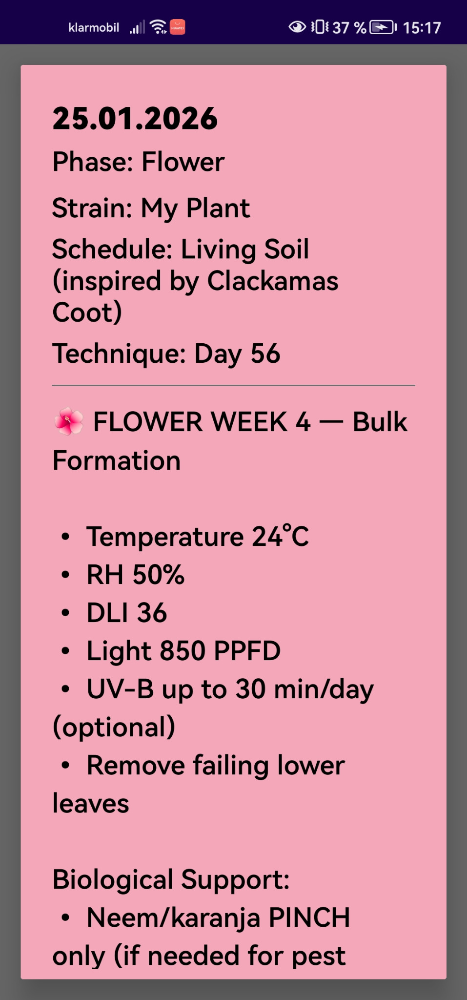
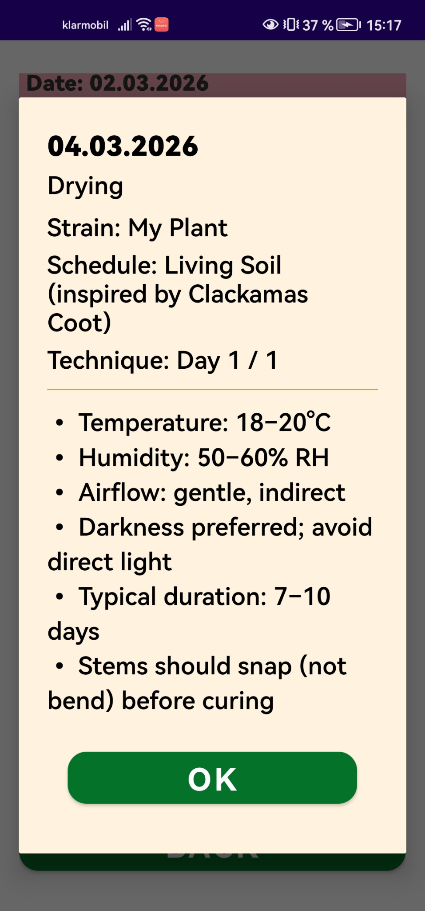
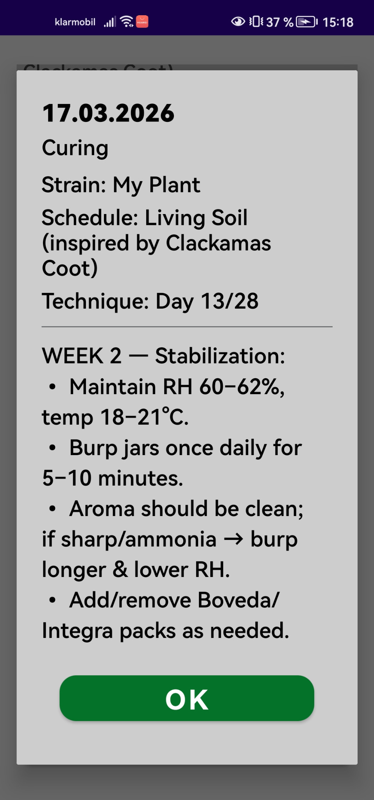

Cannabis Planner

## Screenshots

  
  
  

  
  
  

  
  

Cannabis Planner is a simple, private, offline planning app that helps users organize and understand the different stages of a plant’s lifecycle — from seedling to harvest, drying, and curing.

The app generates a structured day-by-day schedule based on user input and preferences. It is designed purely as a planning and logging tool.

✨ Features

Autoflower & photoperiod friendly

Adjustable phase durations

Track multiple plants

Phase-colored daily schedule

Works fully offline — no accounts, no syncing

No ads, no tracking

🔒 Privacy

All data is stored locally on the user’s device only.
The app does not collect, transmit, or store any personal data.

⚠️ Disclaimer

This application is intended for educational and planning purposes only.
Users are responsible for complying with all local laws and regulations in their region.
