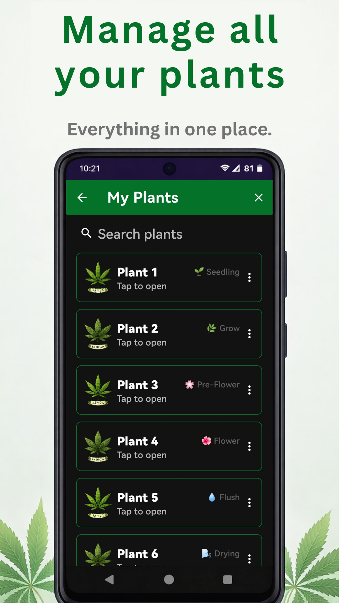
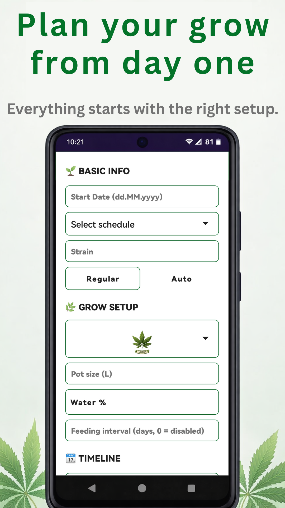
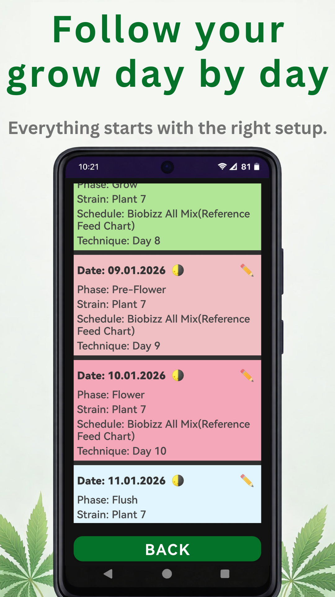
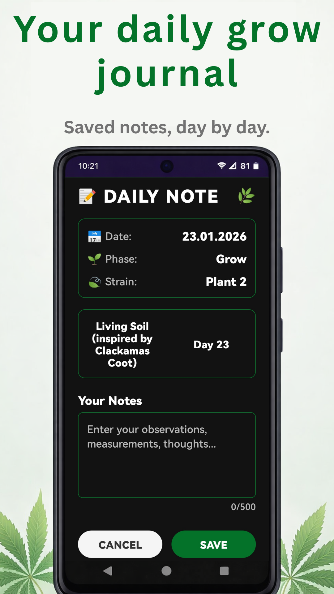
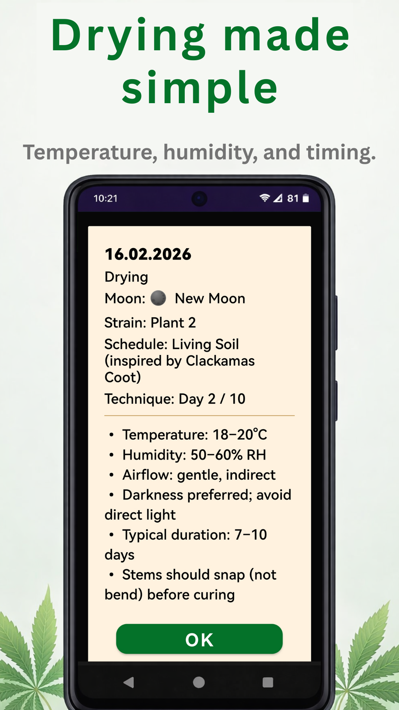
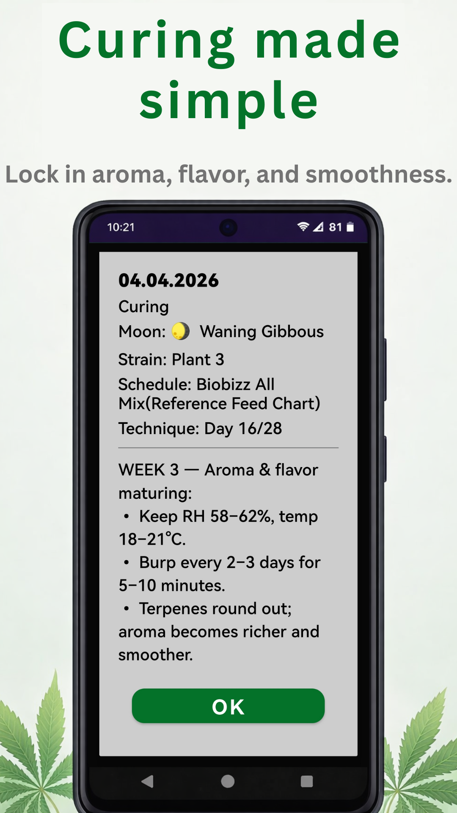

🌱 Cannabis Planner

Cannabis Planner is a simple, private, and fully offline planning app designed to help users organize and understand the different stages of a plant’s lifecycle — from seedling to harvest, drying, and curing.

The app generates a structured, day-by-day schedule based on user input and preferences. It is designed purely as a planning and logging tool, with no automation, tracking, or online services.

## Screenshots

  
   
  

   
   

  
  
 
 

✨ Features

Supports autoflower & photoperiod plants

Adjustable phase durations (Seedling → Grow → Flower → Flush → Drying → Curing)

Track multiple plants independently

Phase-colored daily schedule for clear visual planning

Daily notes & observations

Works 100% offline — no accounts, no syncing

No ads, no tracking, no analytics

🔒 Privacy

All data is stored locally on the user’s device only.
The app does not collect, transmit, or store any personal or usage data.

⚠️ Disclaimer

This application is intended for educational and planning purposes only.
Users are responsible for complying with all local laws and regulations applicable in their region.
