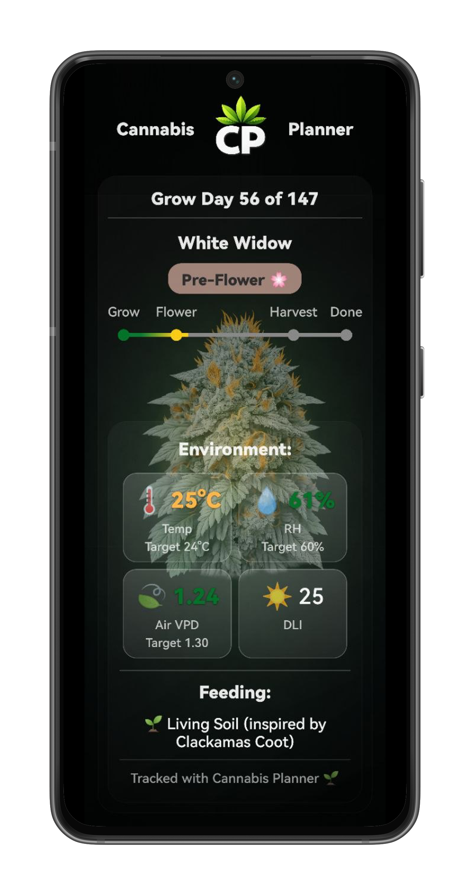
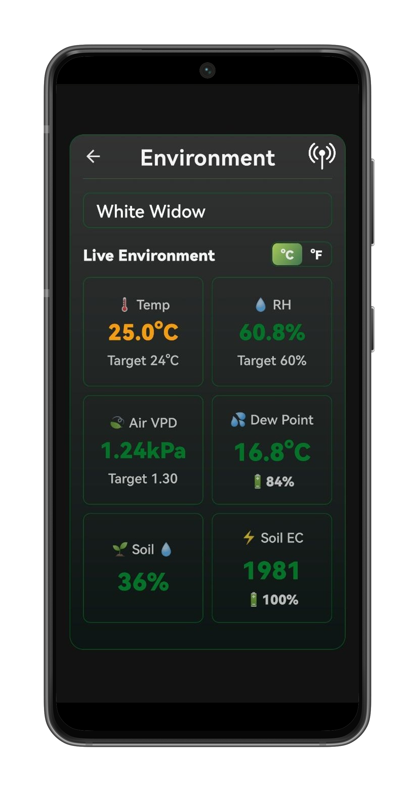
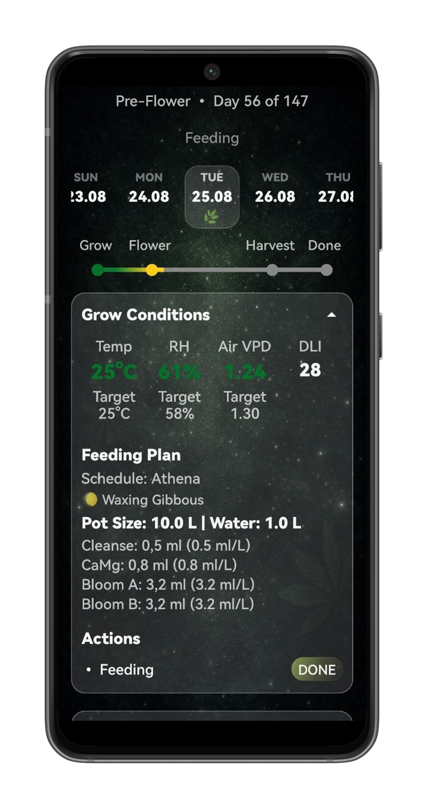
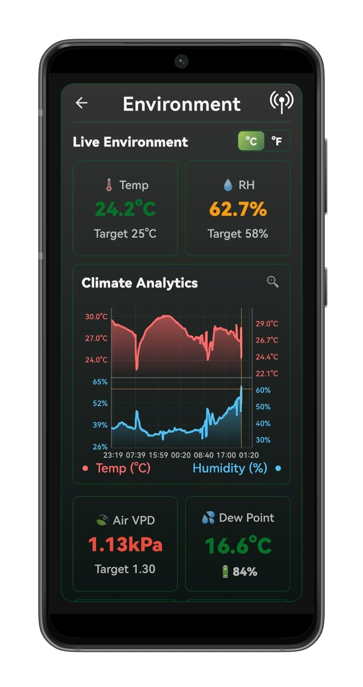

# 🌿 Cannabis Planner
An all-in-one, privacy-focused open-source grow tracker and environmental monitor. Built for both hydro and organic growers (Living Soil) to track plant lifecycles, automate nutrient calculations, and monitor real-time microclimate sensors via Bluetooth / ESP32.

---

## 📱 Screenshots

  
  
  
  

---

## ✨ Key Features

### 💧 Smart Nutrient & Dose Calculation
* **Automated Dosing:** Computes exact nutrient volumes (ml and ml/L) based on pot size, target water volume, and specific feeding schedules.
* **Multi-Schedule Support:** Built-in profiles for popular nutrient lines (General Hydroponics, FoxFarm, BioBizz, Living Soil / Organic setups, etc.).
* **Organic & Stage Guidance:** Phase-specific suggestions (e.g., PPFD targets, light intensity, dryness cycles, biological soil support like Vermicompost).

### 📡 Real-Time Live Environment Monitoring
* **Bluetooth (BLE) & ESP32 Integration:** Connect directly to DIY sensors or BLE environmental monitors.
* **Climate Metrics:** Live track **Temperature**, **Relative Humidity (RH)**, **Air VPD**, **Dew Point**, and **DLI**.
* **Soil Health Tracking:** Monitor **Soil Moisture (%)** and **Soil EC** in real time.
* **Target Ranges:** Visual color indicators (Green = Optimal, Red/Orange = Out of range) based on targeted growth stages.

### 📡 Supported Hardware & Sensors
Connect your environmental sensors via direct Bluetooth (BLE) or through ESP32:
* **Govee:** H5075 (H5074 likely supported)
* **TempPro:** TP357 (TP358 / TP359 likely supported)
* **Xiaomi:** Flashed custom firmware sensors
* **Xiaomi Flower Care** (Soil Moisture & Soil EC / NPK monitoring)

Don't have a compatible BLE sensor? Build your own with an ESP32 board using our web-based firmware installer — no software installation required:

👉 **[Install ESP32 Sensor Firmware](https://cannabisplanner.github.io/mysensor-instal/)**

📺 Watch the full setup tutorial: **[YouTube video guide](https://www.youtube.com/watch?v=27Nmx-xaarU))**

> ⚠️ Works only in Chrome or Edge on desktop (Windows/Mac/Linux/ChromeOS). Does not work on mobile browsers or in Firefox/Safari.

### 📊 Advanced Climate Analytics
* **Historical Charts:** Detailed interactive charts for temperature and humidity trends over time.
* **Fullscreen / Landscape Mode:** Rotate device for expanded chart analysis.

### 📅 Lifecycle & Moon Phase Tracking
* **Stage Tracking:** Full support for autoflower and photoperiod strains across all stages (Seedling, Veg, Flower, Flush, Drying, Curing).
* **Lunar Calendar:** Built-in Moon Phase integration to align feedings with lunar cycles.
* **Journaling:** Daily photo logs, notes, and progress tracking.

---

## 🛡️ Privacy First
* **100% Offline:** All data stays on your device.
* **No Cloud Sync or Accounts:** No registration required.
* **No Analytics or Tracking:** Zero telemetry or data collection.

---

## 🚀 Getting Started
1. Download the app directly from [Google Play Store](https://play.google.com/store/apps/details?id=com.ivangospocic.cannabisplanner).
2. Pair your BLE or ESP32 sensor in the Environment tab (see supported hardware above, or [flash your own ESP32](https://cannabisplanner.github.io/mysensor-instal/)).
3. Add your first plant, set your pot size and feeding plan, and start logging!

---

## 🤝 Contributing
Contributions, bug reports, and feature requests are welcome! Feel free to open an issue or submit a pull request.

---

## 🔒 License
Copyright (c) 2026. All rights reserved.
Copying, modifying, and selling this code for commercial purposes is strictly prohibited without the explicit permission of the author.
